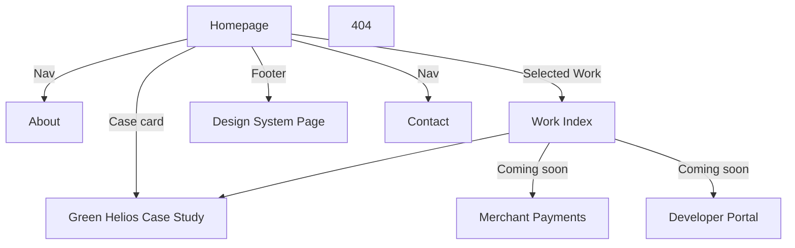
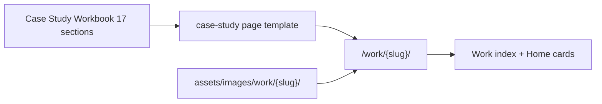

# Ioanna Zarkadoula Portfolio — Implementation Plan

**Stack (locked):** Static HTML5, Vanilla CSS3, Vanilla JS. No frameworks, no Bootstrap, no Tailwind, no React. Target Lighthouse 95+.

**Source priority (never invent):**
1. [docs/Design System.jpg](docs/Design%20System.jpg) — visual tokens & components
2. [docs/Main Portfolio.pdf](docs/Main%20Portfolio.pdf) — bio, expertise, experience, education, certs, contact
3. [docs/Case Study Workbook.html](docs/Case%20Study%20Workbook.html) — case study section structure (do not simplify)
4. [docs/Green Helios.pdf](docs/Green%20Helios.pdf) — first case study content & product screenshots
5. [docs/Portfolio Reference.jpg](docs/Portfolio%20Reference.jpg) — layout inspiration only (never copy)

**Design personality:** Editorial / Swiss / Linear / Stripe / Apple — calm, readable, documentation-first. One accent blue on neutrals. No glassmorphism, dark gradients, heavy shadows, or decorative motion.

---

## Information Architecture

### Site purpose
Hiring managers should understand in under 30 seconds: who Ioanna is, fintech/payments specialization, problems she solves, and why to interview her. The site documents how she thinks — not a gallery.

### Content model



### Content ownership by source
| Page / section | Source |
|---|---|
| Hero, expertise, experience, education, certifications, contact details | Main Portfolio.pdf |
| Layout rhythm, section order cues | Portfolio Reference.jpg (inspiration) |
| Portfolio colors, type, spacing, UI components | Design System.jpg |
| Case study section taxonomy (17 sections) | Case Study Workbook.html |
| Green Helios narrative, metrics, screens, dual architecture | Green Helios.pdf |

### Critical content gap (pre-Phase 5)
Green Helios PDF covers ~7 narrative blocks (Problem, Process, User, Visual Language, Screens, Architecture, Takeaways). The Workbook requires **17 sections**. Implementation will map PDF material into the full Workbook skeleton and **flag empty sections for authoring** rather than inventing outcomes, research numbers, or reflections.

---

## Website Sitemap

| URL | Page | Primary job |
|---|---|---|
| `/` | Homepage | 30-second pitch + path to work |
| `/about/` | About | Fuller bio, languages, technical skills |
| `/work/` | Work index | All case studies (live + coming soon) |
| `/work/green-helios/` | Case study | Full product-thinking documentation |
| `/design-system/` | Design system | Living token/component documentation |
| `/contact/` | Contact | Reach out + social links |
| `/404.html` | Not found | Recovery paths |

**Also ship:** `/robots.txt`, `/sitemap.xml`, `/favicon` assets.

---

## Page Hierarchy

### 1. Homepage `/` (keep short — details live in case studies)
1. **Hero** — Name as brand-level signal; eyebrow (`Product Designer · Fintech · Payments · Design Systems`); 1 short bio paragraph from Main Portfolio; CTA group (View work / Contact); contact strip (email, LinkedIn, GitHub, Behance, Athens)
2. **Core Expertise** — Categories: Product Design, Fintech, Collaboration, Technical (tags from Main Portfolio)
3. **Selected Work** — 3 cards: Green Helios (live), Merchant Payments (coming soon), Developer Portal (coming soon / confidential)
4. **Experience** — CO.DE Agency, Product Designer, 2023–Present + condensed bullets
5. **Education** — Mediterranean College BSc CS; IEK Delta Graphic Design
6. **Certifications** — Google UX courses + Vellum
7. **Footer** — identity, Design System link, Contact link

### 2. About `/about/`
- Expanded positioning + CS studies rationale
- Full expertise (including Technical)
- Languages (Greek Native, English B2)
- Soft CTA to Work and Contact
- No duplicate long case-study content

### 3. Work `/work/`
- Page intro (one sentence: selected product design case studies)
- Case study list/cards with status (Published / Coming soon / Confidential)
- Green Helios only clickable complete study initially

### 4. Green Helios `/work/green-helios/`
**Locked Workbook order (17 sections).** Map PDF content; author gaps before ship.

| # | Section | PDF mapping |
|---|---|---|
| 01 | Hero | Logo, tagline, role/duration/platform, tags, hero device, headline outcome |
| 02 | Business Context | Gap — author from market/spreadsheet framing in Workbook examples + PDF problem framing |
| 03 | The Problem | PDF `01 · Problem` |
| 04 | Constraints | Partial — solo designer-developer, dual stack; expand |
| 05 | Users | PDF `03 · User` (Kostas persona + JTBD goals) |
| 06 | Research | Gap — methods/insights not in PDF |
| 07 | Success Metrics | Partial — PDF metrics cards (10 screens / 2 architectures / 1 designer); expand UX vs business metrics |
| 08 | Design Strategy | PDF design principles |
| 09 | Information Architecture | PDF process + screen IA (sidebar structure) |
| 10 | Design Decisions ★ | Partial — V1 vs V2 comparisons; author ≥3 full Decision blocks |
| 11 | Design System | PDF `04 · Visual Language` (product tokens — separate from portfolio DS) |
| 12 | Accessibility | Gap — author concrete WCAG criteria if true |
| 13 | Prototype | PDF live/GitHub links |
| 14 | Technical Collaboration | PDF `06 · Architecture` (Bootstrap limits vs React precision) |
| 15 | Results | Gap / qualitative — do not invent hard metrics |
| 16 | Reflection ★ | Gap — author honest reflection |
| 17 | Next Steps | Gap — author named next feature |

**Reading experience:** long-form editorial; content measure ~700–800px; large margins; images breathe; sticky optional mini-TOC for long page.

### 5. Design System `/design-system/`
Mirror [docs/Design System.jpg](docs/Design%20System.jpg): Color, Type, Spacing, Components (buttons, tags, case-study blocks). This page documents the **portfolio** system (neutral + one blue accent), not Green Helios product teal.

### 6. Contact `/contact/`
Email primary CTA; LinkedIn, GitHub, Behance; location Athens. Phone: include only if you explicitly want it public (present in Main Portfolio; treat as a privacy decision at build time).

### 7. 404
Short message + links to Home and Work.

---

## Content Strategy

Every page has one job. Copy stays scannable on index pages; depth lives only in case studies.

### Global audience
- **Primary:** Senior/Lead/Staff Product Designers, Design Managers, Head of Design, Hiring Managers at fintech-scale companies (Stripe, Revolut, Wise, Booking, Shopify, Microsoft, Google)
- **Secondary:** Recruiters, Engineers, Product Managers

### Per-page content brief

#### Homepage `/`
| Field | Definition |
|---|---|
| **Purpose** | Deliver the 30-second pitch: who, specialty, proof, next step |
| **Target audience** | Hiring managers and recruiters on first visit |
| **Primary CTA** | View selected work → `/work/` (secondary: Contact) |
| **Reading time** | 1–2 minutes |
| **Required assets** | Brand mark (IZ); favicon; optional subtle hero atmosphere (not a product screenshot collage); 3 work-card thumbnails or typographic cards |
| **Missing assets** | Final brand SVG/PNG mark; work-card covers for Merchant Payments and Developer Portal (use typographic “Coming soon” until ready); OG image for homepage |

#### About `/about/`
| Field | Definition |
|---|---|
| **Purpose** | Expand positioning, technical depth (CS studies), languages — without repeating case studies |
| **Target audience** | Hiring managers who want context after the homepage scan |
| **Primary CTA** | View work → `/work/` (secondary: Contact) |
| **Reading time** | 2–3 minutes |
| **Required assets** | None mandatory beyond brand; optional professional portrait only if it strengthens trust (not required by source docs) |
| **Missing assets** | Longer About narrative beyond Main Portfolio bio (author before build); portrait decision |

#### Work index `/work/`
| Field | Definition |
|---|---|
| **Purpose** | Catalog of case studies with clear status (Published / Coming soon / Confidential) |
| **Target audience** | Designers and hiring managers evaluating breadth and depth |
| **Primary CTA** | Open Green Helios case study |
| **Reading time** | Under 1 minute |
| **Required assets** | One cover treatment per case (image or strong typographic card) |
| **Missing assets** | Covers + one-line summaries for Merchant Payments and Developer Portal; confidential constraints copy for Dev Portal |

#### Green Helios `/work/green-helios/`
| Field | Definition |
|---|---|
| **Purpose** | Document product thinking end-to-end using the 17-section Workbook |
| **Target audience** | Design Managers and senior designers evaluating reasoning quality |
| **Primary CTA** | View prototype / live project (secondary: GitHub repos) |
| **Reading time** | 8–12 minutes (long-form; TOC for scanning) |
| **Required assets** | Hero device mock; curated V1/V2 screen pairs; architecture diagram or stack cards; logo; decision-supporting crops; OG image |
| **Missing assets** | Authored copy for Business Context, Research, Accessibility, Results, Reflection, Next Steps; ≥3 full Design Decision write-ups; exported/optimized WebP screen set; working prototype + GitHub URLs verified; product logo SVG if available separately from PDF raster |

#### Design System `/design-system/`
| Field | Definition |
|---|---|
| **Purpose** | Prove systems thinking; living documentation of portfolio tokens and components |
| **Target audience** | Designers and engineers assessing craft and handoff maturity |
| **Primary CTA** | Back to work / Contact (no sales CTA) |
| **Reading time** | 3–5 minutes |
| **Required assets** | Live components (not only screenshots); color swatches rendered in HTML/CSS |
| **Missing assets** | Exact font file licenses once families are identified from Design System.jpg |

#### Contact `/contact/`
| Field | Definition |
|---|---|
| **Purpose** | Make outreach frictionless and professional |
| **Target audience** | Recruiters and hiring managers ready to reach out |
| **Primary CTA** | Email (`ionzark@gmail.com`) |
| **Reading time** | Under 30 seconds |
| **Required assets** | Social icons (LinkedIn, GitHub, Behance) as inline SVG |
| **Missing assets** | Decision on publishing phone number; optional contact form endpoint (default: mailto only — no backend) |

#### 404
| Field | Definition |
|---|---|
| **Purpose** | Recover lost visitors without breaking brand tone |
| **Target audience** | Anyone on a broken link |
| **Primary CTA** | Go to homepage (secondary: Work) |
| **Reading time** | Instant |
| **Required assets** | None |
| **Missing assets** | None |

### Content principles
- Documentation voice: precise, calm, no marketing adjectives (“beautiful”, “innovative”)
- Homepage stays short; case studies hold depth
- Never invent metrics, research counts, or results
- Future case studies reuse the same Workbook content model (see Scalability Strategy)

---

## Design Tokens

**Rule:** Values below are the implementation contract derived from [docs/Design System.jpg](docs/Design%20System.jpg). Phase 1 freezes final hex/type sizes by eye-match to that file. Do not invent new colors, spacing steps, or type roles outside this system.

### Color tokens

**Strategy:** Neutral grayscale + one accent blue. Accent used only for links, focus, and primary actions. No gradients on portfolio chrome.

| Token | Role | Proposed value (freeze in Phase 1) |
|---|---|---|
| `--color-accent-50` | Tint background | `#ECF0FC` (sampled) |
| `--color-accent-100` | Soft chip / tag fill | `#DCE4FC` (sampled) |
| `--color-accent-300` | Secondary accent / hover wash | `#90B0F8` (sampled) |
| `--color-accent-500` | Primary action / link | `#2060E8` (sampled) |
| `--color-accent-600` | Hover primary | `#1848D0` (sampled) |
| `--color-accent-700` | Active / pressed | `#1840A8` (sampled) |
| `--color-neutral-0` | Page background | `#FFFFFF` |
| `--color-neutral-50` | Subtle surface | near-white gray from DS |
| `--color-neutral-100` | Dividers / hairlines | light gray from DS |
| `--color-neutral-200` | Borders | mid-light gray |
| `--color-neutral-400` | Muted icons | mid gray |
| `--color-neutral-500` | Meta / captions | mid-dark gray |
| `--color-neutral-700` | Secondary text | dark gray |
| `--color-neutral-900` | Primary text | near-black `#080808`–`#14141C` |
| `--color-neutral-1000` | Maximum ink | `#000000` if present in DS |
| `--color-success` | Positive metric delta only | green tint (DS metric examples) |
| `--color-danger` | Negative metric delta only | red tint (DS metric examples) |
| `--color-focus` | Focus ring | `--color-accent-500` or 700 |

**Product-only colors (Green Helios figures, never site chrome):** `#00C896`, `#F5A623`, `#00BCD4`, `#EF4444`, `#1A1A2E`, `#6B7280`, `#F8F9FA` — scoped under case-study figure captions or annotated callouts, not global tokens.

**Contrast:** Body text vs background must meet WCAG AA 4.5:1 (DS states verified 4.5:1). Re-check after Phase 1 freeze.

### Typography scale

| Token | Family role | Use | Notes |
|---|---|---|---|
| `--font-serif` | Editorial serif | `display`, `h1`, section titles | Exact family from DS specimen |
| `--font-sans` | UI / body sans | `h3`, body, nav, buttons | Exact family from DS specimen |
| `--font-mono` | Metrics / eyebrows | `micro`, section numbers, tags | Exact family from DS specimen |

| Step | Role | Typical assignment |
|---|---|---|
| `--text-display` | Hero name / editorial display | Serif, largest |
| `--text-h1` | Page / major section title | Serif |
| `--text-h2` | Subsection | Serif (smaller) |
| `--text-h3` | Card title / block title | Sans, semibold |
| `--text-body-lg` | Reading paragraph (case study) | Sans, ~18–20px equivalent |
| `--text-body` | Default UI text | Sans |
| `--text-small` | Caption / meta | Sans |
| `--text-micro` | Eyebrow label | Mono, uppercase, tracked |

Also tokenize: `--leading-*`, `--tracking-micro`, `--font-weight-regular/medium/semibold`.

**Case study measure:** prose column **700–800px** max for `body-lg` blocks.

### Spacing scale

Base unit: **4px**.

| Token | Value |
|---|---|
| `--space-1` | 4px |
| `--space-2` | 8px |
| `--space-3` | 12px |
| `--space-4` | 16px |
| `--space-5` | 20px |
| `--space-6` | 24px |
| `--space-8` | 32px |
| `--space-10` | 40px |
| `--space-12` | 48px |
| `--space-16` | 64px |
| `--space-20` | 80px |
| `--space-24` | 96px |

Section vertical rhythm uses large steps (`--space-16`–`--space-24`). Component padding uses `--space-4`–`--space-8`.

### Grid

- **Columns:** 12
- **Column + gutter system:** fluid inside container; gutters derived from spacing scale
- **Page gutter:** `--space-8` (32px) desktop; ≥ `--space-4` (16px) mobile
- **Alignment:** content and cards snap to the same column edges

### Breakpoints

Desktop-first media queries:

| Token | Width | Intent |
|---|---|---|
| `--bp-desktop` | ≥1200px | Full grid |
| `--bp-tablet` | ≤1199px | Compress columns |
| `--bp-mobile` | ≤767px | Single column, disclosed nav |

(Exact px may be expressed as `max-width` queries implementing the above.)

### Container widths

| Token | Value | Use |
|---|---|---|
| `--container-page` | 1200px | Site shell max-width |
| `--container-prose` | 720px–800px | Case study reading column |
| `--container-narrow` | ~640px | Contact / focused forms |
| `--gutter-page` | 32px (16px mobile) | Side padding |

### Radius

Documentation-first, minimal rounding (match DS components — not pill-heavy chrome except where DS shows tags/buttons):

| Token | Proposed use |
|---|---|
| `--radius-0` | 0 — rules, editorial tables if needed |
| `--radius-sm` | Small controls / tags |
| `--radius-md` | Buttons, cards, decision blocks |
| `--radius-pill` | Tags / status chips only where DS shows capsules |

Freeze exact px in Phase 1 from Design System.jpg specimens.

### Elevation

**Strategy:** Prefer borders and spacing over shadows. DS forbids huge shadows.

| Token | Use |
|---|---|
| `--elevation-none` | Default surfaces |
| `--elevation-border` | 1px `--color-neutral-200` hairline (primary separation) |
| `--elevation-1` | Optional very soft shadow only if DS specimens require it for buttons/cards — otherwise omit |

No multi-layer shadow stacks. No glow.

### Motion tokens (supporting)

| Token | Value |
|---|---|
| `--duration-fast` | ≤250ms |
| `--ease-standard` | simple ease-out |
| Allowed properties | opacity, transform translateY |

---

## Scalability Strategy

The site must grow from one published case study to three (and beyond) **without changing routes, shell, tokens, or component vocabulary**.

### Stable spine (never restructure)
- Global IA stays: Home → Work → `/work/{slug}/` → About / Design System / Contact
- Case studies always follow the **17-section Workbook template**
- Portfolio Design System tokens remain the only site chrome language
- Shared partials (`header`, `footer`, case-study blocks) stay global

### Case study as a repeatable product



**To add a future case study (e.g. Merchant Payments, Developer Portal, Piraeus tokens):**
1. Create `src/work/{slug}/index.html` from the same section skeleton (01–17)
2. Add `assets/images/work/{slug}/` for that project only
3. Register the project on `/work/` and Homepage Selected Work (status: Published)
4. Add URL to `sitemap.xml` + unique meta/OG
5. Do **not** add new global CSS frameworks, new nav items per project, or new token palettes for site chrome

### What stays shared vs what is local

| Shared (site-level) | Local (per case study) |
|---|---|
| Header, footer, tokens, type, spacing | Narrative copy for 17 sections |
| `.c-decision`, `.c-insight`, `.c-metric`, gallery, lightbox | Images and product-brand accents inside figures |
| Work card + coming-soon card patterns | Slug, title, eyebrow tags, status |
| Case study TOC pattern | Anchor IDs for that page’s sections |
| SEO patterns (Person stays global) | `CreativeWork` JSON-LD per study |

### Index-driven discovery
- `/work/` is the single catalog — new studies appear as another card/row, same component
- Homepage “Selected Work” shows a curated subset (still the same card component)
- “Coming soon” / “Confidential” are states of the same card — not new page types

### Content pipeline (repeatable)
1. Fill Workbook sections in a draft (bullets → prose)
2. Export/optimize images into the slug folder
3. Drop into template; wire CTAs
4. Accessibility + performance pass on that page only

### Guardrails against structural drift
- No one-off layouts that cannot be reused by the next study
- No site-wide color changes to match a product brand
- Cap homepage selected work (e.g. 3 featured); full list lives on `/work/`
- Confidential projects: card + short abstract only — still no new IA branch

### Planned growth order (from Workbook roadmap)
1. Green Helios (first complete template proof)
2. Merchant Payments or Developer Portal (fintech + engineering collaboration)
3. Piraeus / design tokens study (systems thinking at brand scale)

After Green Helios ships, Phase 5’s template becomes the clone source — not a one-off page.

---

## Component Architecture

**Principle:** HTML partials in `components/`, assembled by a tiny include build (string replace / concatenate). Not a UI framework — only to satisfy “no duplicated HTML” for nav/footer.

### Global shell
- `site-header` — mark + primary nav (Work, About, Design System, Contact); mobile disclosure
- `site-footer` — identity line + secondary links
- `skip-link` — skip to main content

### Content primitives (from Design System)
- `button` — primary / secondary / text / disabled
- `tag` — section label, decision label, status (+/−)
- `section-title` — eyebrow + heading + optional lead
- `metric` — large number + caption
- `card` — work card only (interaction container: link to case study)
- `quote` — pull quote with left border
- `timeline` — process / education
- `gallery` — screen pairs with captions
- `lightbox` — progressive enhancement for gallery (keyboard, focus trap, Esc)
- Case-study blocks: `decision-block`, `insight-block`, `interview-block`, `metric-row`

### Page-specific compositions
- `expertise-group` — category + tag cluster
- `experience-entry` — company / role / dates / bullets
- `education-entry`
- `case-study-toc` — in-page anchors to 17 sections
- `coming-soon-card` — non-link or disabled state with clear label

---

## CSS Architecture

**Source of truth for values:** [Design Tokens](#design-tokens) (frozen in Phase 1 from Design System.jpg).

### File organization
```
assets/css/
  tokens.css       /* custom properties only — maps Design Tokens section */
  reset.css        /* minimal modern reset */
  base.css         /* html/body, typography, links, focus */
  layout.css       /* grid, containers, sections */
  components.css   /* or split per component later if size grows */
  pages.css        /* page-specific layouts */
  utilities.css    /* sparse: spacing helpers only if needed */
```

### Rules
- All colors, type, space, radii, elevation, motion via CSS variables from `tokens.css`
- No inline styles; no duplicated magic numbers outside tokens
- BEM-like or clear component class names (e.g. `.c-decision`, `.c-tag`)
- Motion: max **250ms**; only fade / opacity / translateY / hover
- Product brand colors stay out of global tokens (see Design Tokens → product-only colors)

---

## Responsive Strategy

**Desktop-first** (matches PROJECT.md), using Design Tokens breakpoints. No horizontal scroll.

| Breakpoint | Behavior |
|---|---|
| ≥1200px (`--bp-desktop`) | Full 12-col, `--container-page` 1200px, 32px gutter |
| ≤1199px (`--bp-tablet`) | Collapse work cards 3→2→1; expertise tags wrap; experience stacks |
| ≤767px (`--bp-mobile`) | Single column; nav disclosure; gallery stacks; case-study TOC compact; gutters ≥16px; prose uses `--container-prose` |

Touch targets ≥44px. VS screen comparisons scroll within container if needed, with visible affordance.

---

## Accessibility Strategy

Target: **WCAG 2.1 AA**

- Semantic landmarks: `header`, `nav`, `main`, `footer`; one `h1` per page
- Case study: sequential `h2` for 17 sections; `h3` inside blocks
- Visible focus rings using accent token (never remove outline without replacement)
- Keyboard: all interactive controls; lightbox focus trap + Esc; mobile nav focus return
- Skip link as first focusable
- Contrast: verify body and UI against DS claim (4.5:1 text); large text 3:1
- Images: meaningful `alt`; decorative empty `alt`; complex screens get short alt + long description in caption
- `prefers-reduced-motion: reduce` disables non-essential motion
- ARIA only when native semantics are insufficient (disclosure, lightbox dialog)
- Forms on Contact: labels, errors, `autocomplete`

Audit phase: keyboard pass, VoiceOver spot-check, axe/Lighthouse a11y, contrast check.

---

## Image Strategy

- Never stretch; preserve aspect ratio (`width`/`height` attrs + CSS `max-width:100%`)
- Optimize: WebP (+ PNG/JPEG fallback), compress before commit
- Retina: 2x assets where UI chrome is shown; use `srcset`/`sizes`
- Lazy-load below-fold (`loading="lazy"`); hero eager
- Green Helios: crop/export key screens from PDF (Login, Dashboard V1/V2, Properties, Reports, Architecture) into `assets/images/work/green-helios/`
- Lightbox for full-screen inspection of dense UI
- Do not use Portfolio Reference or Design System JPGs as production page backgrounds — they are source docs only

---

## SEO Strategy

Per page:
- Unique `<title>` and meta description
- Canonical URL
- Open Graph + Twitter Card (title, description, image)
- `lang="en"`

Sitewide:
- `sitemap.xml` with all public routes
- `robots.txt` allowing crawl
- Structured data: `Person` (homepage/about), `WebSite`, `BreadcrumbList` on case study, `CreativeWork`/`Article` for Green Helios
- Semantic heading hierarchy; descriptive link text (“Read Green Helios case study”, not “click here”)
- Fast static hosting (e.g. GitHub Pages / Netlify / Vercel static) — no SSR required

---

## Folder Structure

Align with existing empty dirs (`assets/`, `components/`, `src/`) and PROJECT.md:

```
ioanna-portfolio/
  PROJECT.md
  README.md
  docs/                          # source of truth (do not ship to prod unnecessarily)
  components/
    header.html
    footer.html
    skip-link.html
  src/
    index.html                   # or built output root — see note
    about/index.html
    work/index.html
    work/green-helios/index.html
    design-system/index.html
    contact/index.html
    404.html
  assets/
    css/
    js/
      main.js                    # nav, lightbox, reduced-motion
    images/
      brand/
      work/green-helios/
      og/
    icons/
    fonts/
  scripts/
    build-includes.js            # tiny include assembler (optional but recommended)
  robots.txt
  sitemap.xml
```

**Build note:** Prefer writing pages under `src/` with `<!-- include:header -->` markers and a minimal Node/Python script that emits a deployable root (or `dist/`). If you reject any build step, maintain header/footer as single-source partials and paste carefully — still store canonical partials in `components/`.

---

## Reusable Components (checklist)

| Component | Used on |
|---|---|
| Skip link, Header, Footer | All pages |
| Button (3 variants) | Hero, case study CTAs, DS page |
| Tag / eyebrow | Expertise, case labels, DS |
| Section title | All content pages |
| Work card / Coming soon card | Home, Work |
| Expertise group | Home, About |
| Experience entry | Home, About |
| Education / timeline entry | Home, About |
| Metric | Home (optional), Green Helios, DS |
| Decision / Insight / Interview / Quote blocks | Green Helios, DS examples |
| Gallery + Lightbox | Green Helios |
| In-page TOC | Green Helios |
| Architecture comparison panel | Green Helios §14 |

---

## Risks

1. **Content incompleteness for Green Helios** — Workbook 17 vs PDF ~7. Highest risk. Mitigation: content inventory spreadsheet before Phase 5; leave no fake metrics; author Reflection/Research/Next Steps deliberately.
2. **Token extraction ambiguity** — Design System is a JPG, not a token file. Mitigation: Phase 1 eye-match + contrast verification; freeze tokens before building pages.
3. **Font licensing / naming** — Families not text-exported from JPG. Mitigation: identify from specimen; self-host licensed/open fonts only.
4. **Scope creep from Green Helios screen volume** — 10 screens × 2 versions. Mitigation: curated gallery (key decisions), not every frame.
5. **Confidential work** — Developer Portal labeled confidential. Mitigation: coming-soon card, no screenshots, no internal details.
6. **Duplicated HTML without includes** — Mitigation: tiny include build or strict partial discipline.
7. **Phone number privacy** — Mitigation: confirm before publishing Contact.
8. **Reference bleed** — Warm CV PDF colors / Reference layout must not override Design System blue-neutral tokens.
9. **Performance from large PNGs** — Mitigation: compress, WebP, lazy-load, limit lightbox originals.
10. **Phase order discipline** — PROJECT.md forbids building the whole site in one pass. Stop after each phase for review.

---

## Development Phases

Follow [PROJECT.md](PROJECT.md) workflow exactly. Stop after each phase for approval.

### Phase 1 — Project Architecture
- Finalize folder structure, include build (if used), font files, reset/base/layout stubs
- Freeze **Design Tokens** into `tokens.css` (eye-match Design System.jpg; contrast-check)
- Empty page shells with correct titles/canonicals aligned to **Content Strategy** briefs
- Scaffold reusable case-study template path for **Scalability Strategy** (`/work/{slug}/`)
- `robots.txt` + `sitemap.xml` stubs
- Document frozen token table in README

### Phase 2 — Homepage
- Implement all homepage sections with Main Portfolio copy
- Work cards (1 live, 2 coming soon)
- No case-study detail yet

### Phase 3 — Navigation
- Complete header/footer behavior, mobile disclosure, active states, skip link
- Wire all routes; 404 shell

### Phase 4 — Design System Page
- Living documentation matching Design System.jpg sections
- Real components used on the site (not screenshots-only)

### Phase 5 — Green Helios
- Content gap fill (author missing Workbook sections)
- Full 17-section page, gallery, decision blocks, architecture comparison, CTAs to GitHub/live
- In-page TOC + reading measure

### Phase 6 — Remaining Pages
- About, Work index, Contact, polished 404
- SEO meta + OG images per page
- JSON-LD

### Phase 7 — Responsive
- Desktop → tablet → mobile passes across all pages
- Gallery, TOC, nav, expertise tags, VS layouts

### Phase 8 — Accessibility Audit
- Keyboard, focus, headings, contrast, reduced motion, VoiceOver spot-check
- Fix to AA

### Phase 9 — Performance Optimization
- Image compression, `srcset`, font subsetting/`font-display`, minify if needed
- Lighthouse ≥95 Performance / Accessibility / Best Practices / SEO

### Phase 10 — Final Polish
- Copy proof, link check, lightbox edge cases, empty states, cross-browser sanity
- Confirm the site feels like premium product documentation — not a Dribbble gallery

---

## Explicit non-goals (this plan)
- No HTML/CSS/JS generation in this phase
- No copying Portfolio Reference layout literally
- No inventing Green Helios research metrics or results
- No framework migration
